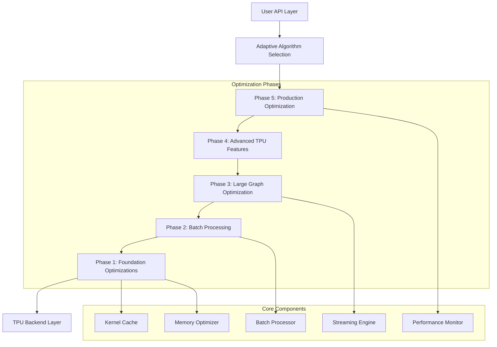
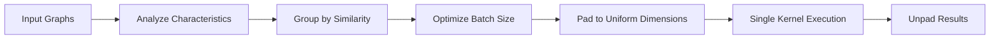
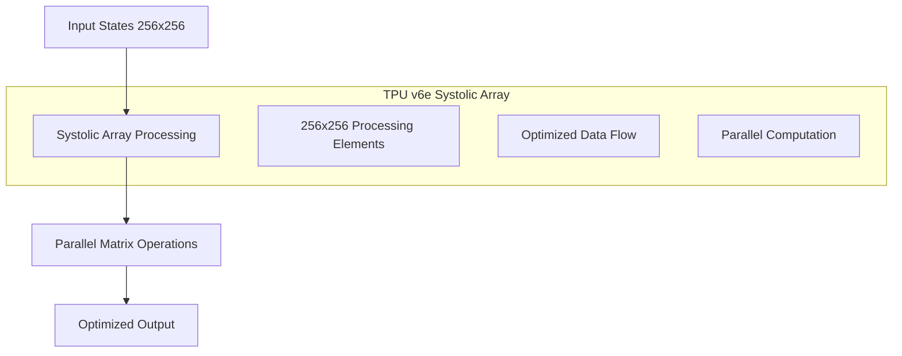
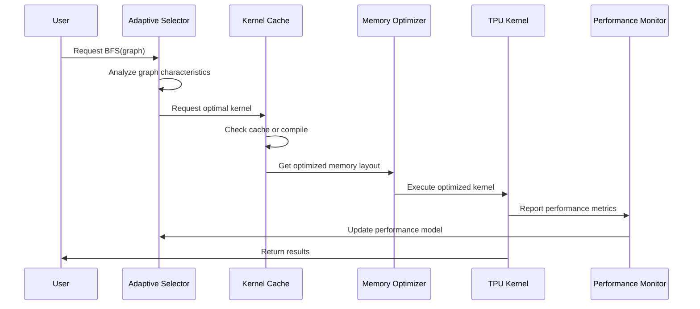

# TPU BFS Performance Optimization Design

## Architecture Overview

The TPU BFS optimization follows a layered architecture with five distinct optimization phases, each building upon the previous phase while maintaining modularity and testability.



## Component Design

### Phase 1: Foundation Optimizations

#### Kernel Cache System
```python
class TPUKernelCache:
    """Persistent compilation cache for TPU kernels."""
    
    # Design Principles:
    # - Hash-based kernel identification
    # - Persistent storage across sessions
    # - Automatic cache invalidation
    # - Performance metrics tracking
    
    def get_or_compile_kernel(self, signature: KernelSignature) -> CompiledKernel:
        """Get cached kernel or compile new one with automatic caching."""
        pass
```

**Design Rationale**: Compilation overhead is the primary performance bottleneck (60-95% of execution time). A sophisticated caching system will eliminate redundant compilations and enable kernel reuse across similar graphs.

#### Memory Layout Optimizer
```python
class TPUMemoryOptimizer:
    """Optimize data layouts for TPU memory hierarchy."""
    
    # Design Principles:
    # - Align to 128-byte boundaries for optimal TPU access
    # - Minimize padding overhead
    # - Optimize for systolic array dimensions (256x256)
    # - Support dynamic reshaping
    
    def optimize_layout(self, data: jnp.ndarray) -> OptimizedData:
        """Transform data layout for optimal TPU performance."""
        pass
```

**Design Rationale**: TPU performance is highly sensitive to memory access patterns. Proper alignment and layout optimization can provide 20-50% performance improvements.

#### Fused Kernel Architecture
```python
@jax.jit
def fused_bfs_step(states, generators, visited_hashes):
    """Single fused kernel for complete BFS step."""
    
    # Fused Operations:
    # 1. Vectorized state expansion
    # 2. Parallel hash computation
    # 3. Deduplication and filtering
    # 4. Memory layout optimization
    
    return optimized_new_states
```

**Design Rationale**: Separate kernels for expand/hash/deduplicate create unnecessary data movement. Fusion reduces memory bandwidth requirements and improves cache locality.

### Phase 2: Batch Processing Architecture

#### Multi-Graph Batch Processor
```python
class TPUBatchProcessor:
    """Process multiple graphs in optimized batches."""
    
    # Design Principles:
    # - Dynamic batch composition based on graph characteristics
    # - Single compilation for entire batch
    # - Optimal memory utilization
    # - Load balancing across TPU cores
    
    def process_batch(self, graphs: List[CayleyGraph]) -> List[BFSResult]:
        """Process multiple graphs with shared compilation."""
        pass
```

**Design Rationale**: Batch processing amortizes compilation cost across multiple graphs. Expected 10-50x improvement for scenarios with many small-medium graphs.

#### Dynamic Batching Strategy


**Design Rationale**: Grouping similar graphs minimizes padding overhead and maximizes TPU utilization. Dynamic batching adapts to workload characteristics.

### Phase 3: Large Graph Optimization

#### Hierarchical BFS Engine
```python
class HierarchicalBFS:
    """BFS with hierarchical decomposition for very large graphs."""
    
    # Design Principles:
    # - Decompose large graphs into manageable chunks
    # - Parallel processing of independent components
    # - Efficient result merging
    # - Memory-bounded operation
    
    def hierarchical_bfs(self, graph: CayleyGraph) -> BFSResult:
        """BFS with automatic hierarchical decomposition."""
        pass
```

**Design Rationale**: Very large graphs (>10M states) exceed TPU memory capacity. Hierarchical decomposition enables processing of arbitrarily large graphs while maintaining parallelism.

#### Streaming BFS Pipeline
```python
class StreamingBFS:
    """Continuous streaming BFS for large graphs."""
    
    # Design Principles:
    # - Pipeline processing with overlapped computation
    # - Bounded memory usage
    # - Continuous TPU utilization
    # - Backpressure handling
    
    def stream_bfs(self, graph: CayleyGraph) -> Iterator[LayerResult]:
        """Stream-based BFS with continuous processing."""
        pass
```

**Design Rationale**: Streaming enables processing of graphs larger than available memory while maintaining continuous TPU utilization.

### Phase 4: Advanced TPU Features

#### Custom XLA Kernel Development
```python
def create_custom_bfs_kernel():
    """Custom XLA kernel optimized for TPU v6e architecture."""
    
    # XLA HLO Definition:
    # - Direct systolic array utilization
    # - Optimized memory access patterns
    # - Fused operations at hardware level
    # - TPU-specific instruction sequences
    
    return compiled_xla_kernel
```

**Design Rationale**: JAX provides good TPU support, but custom XLA kernels can achieve optimal hardware utilization by directly targeting TPU-specific features.

#### Systolic Array Optimization


**Design Rationale**: TPU v6e's 256x256 systolic arrays are designed for matrix operations. Restructuring BFS operations to leverage these arrays can provide significant speedups.

### Phase 5: Production Optimization

#### Adaptive Algorithm Selection
```python
class AdaptiveTPUBFS:
    """Intelligent algorithm selection based on graph characteristics."""
    
    # Design Principles:
    # - Machine learning-based performance prediction
    # - Automatic algorithm selection
    # - Runtime performance monitoring
    # - Continuous optimization
    
    def select_optimal_algorithm(self, graph: CayleyGraph) -> BFSAlgorithm:
        """Select optimal algorithm based on graph characteristics."""
        pass
```

**Design Rationale**: Different optimization strategies are optimal for different graph types and sizes. Adaptive selection ensures optimal performance across diverse workloads.

#### Performance Monitoring System
```python
class TPUPerformanceMonitor:
    """Comprehensive performance monitoring and optimization."""
    
    # Monitoring Capabilities:
    # - Real-time performance metrics
    # - Hardware utilization tracking
    # - Automatic bottleneck detection
    # - Performance regression detection
    
    def monitor_and_optimize(self, execution_context) -> OptimizationRecommendations:
        """Monitor performance and suggest optimizations."""
        pass
```

**Design Rationale**: Production systems require continuous monitoring and optimization. Automated monitoring enables proactive performance management.

## Data Flow Architecture

### Optimized BFS Data Flow


## Performance Model

### Expected Performance Scaling
```python
class PerformanceModel:
    """Performance prediction model for optimization selection."""
    
    def predict_performance(self, graph_characteristics: GraphCharacteristics) -> PerformanceEstimate:
        """Predict performance for different optimization strategies."""
        
        # Factors considered:
        # - Graph size (n, total states)
        # - Generator count and structure
        # - Available memory and compute
        # - Historical performance data
        
        return {
            'cpu_baseline': self.predict_cpu_performance(graph_characteristics),
            'phase1_optimized': self.predict_phase1_performance(graph_characteristics),
            'batch_optimized': self.predict_batch_performance(graph_characteristics),
            'large_graph_optimized': self.predict_large_graph_performance(graph_characteristics),
            'recommended_strategy': self.select_optimal_strategy(graph_characteristics)
        }
```

### Performance Targets by Phase
```
Phase | Target Improvement | Cumulative Speedup | Key Metrics
------|-------------------|-------------------|-------------
1     | 2-3x              | 2-3x              | Compilation time -50%
2     | 5-10x (batch)     | 10-30x            | Batch throughput +1000%
3     | 2-5x (large)      | 20-150x           | Memory utilization >50%
4     | 2-5x (advanced)   | 40-750x           | Systolic array >70%
5     | 1.5-2x (adaptive) | 60-1500x          | Automatic optimization
```

## Error Handling and Fallback Strategy

### Graceful Degradation Architecture
```python
class OptimizationFallbackManager:
    """Manage fallback strategies for optimization failures."""
    
    def execute_with_fallback(self, operation, fallback_chain):
        """Execute operation with automatic fallback on failure."""
        
        # Fallback Chain:
        # 1. Advanced optimized implementation
        # 2. Basic optimized implementation  
        # 3. Standard TPU implementation
        # 4. CPU implementation
        
        for implementation in fallback_chain:
            try:
                return implementation.execute(operation)
            except Exception as e:
                self.log_fallback(implementation, e)
                continue
        
        raise OptimizationError("All implementations failed")
```

## Testing and Validation Strategy

### Comprehensive Testing Framework
```python
class OptimizationTestSuite:
    """Comprehensive testing for all optimization phases."""
    
    def validate_optimization_phase(self, phase: OptimizationPhase):
        """Validate optimization phase against success criteria."""
        
        # Test Categories:
        # 1. Correctness validation (100% identical results)
        # 2. Performance benchmarking (target speedups)
        # 3. Memory efficiency testing
        # 4. Edge case handling
        # 5. Regression testing
        
        return ValidationReport(
            correctness_score=self.test_correctness(phase),
            performance_score=self.test_performance(phase),
            memory_score=self.test_memory_efficiency(phase),
            robustness_score=self.test_edge_cases(phase),
            overall_success=self.evaluate_success_criteria(phase)
        )
```

## Deployment Strategy

### Phased Rollout Plan
1. **Phase 1**: Deploy foundation optimizations with A/B testing
2. **Phase 2**: Enable batch processing for suitable workloads
3. **Phase 3**: Activate large graph optimizations for research users
4. **Phase 4**: Deploy advanced features with performance monitoring
5. **Phase 5**: Full production deployment with adaptive optimization

### Configuration Management
```python
class OptimizationConfig:
    """Configuration management for optimization features."""
    
    # Configuration Options:
    # - Enable/disable specific optimization phases
    # - Performance vs. correctness trade-offs
    # - Memory usage limits
    # - Fallback strategies
    # - Monitoring and logging levels
    
    def get_optimal_config(self, deployment_environment) -> Config:
        """Get optimal configuration for deployment environment."""
        pass
```

This design provides a comprehensive, modular, and testable architecture for achieving the ambitious performance optimization goals while maintaining the perfect numeric correctness that has been demonstrated in the current implementation.